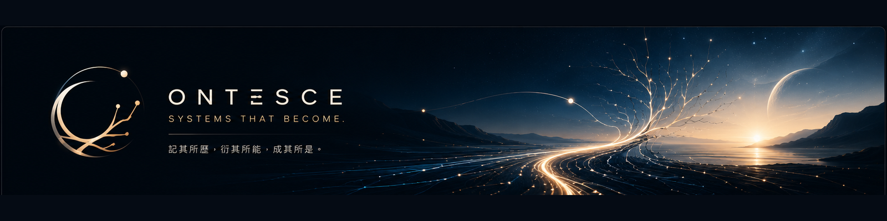

  

# Ontesce

**Systems that become.**

Ontesce explores systems that retain what they learn, expand what they can do, and continue becoming.

We are building toward:

* Persistent character runtimes
* Project memory and decision continuity
* AI-native development harnesses
* Multi-agent creative workflows
* Living worlds shaped by memory, relationships, and change

> 記其所歷，衍其所能，成其所是。

## Current status

Ontesce is currently in its early research and prototyping stage.

Architecture, experiments, and public developer resources will be published here as they mature.

## Projects

Repositories and documentation will be added progressively.
